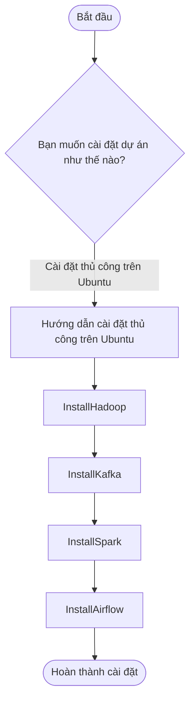

# Pipeline Dữ liệu cho Hệ thống Gợi ý Phim

## Tổng quan
- Dự án tập trung xây dựng một hệ thống kỹ thuật dữ liệu hiện đại, hỗ trợ thu thập, lưu trữ, xử lý và phân tích dữ liệu phim qua các năm, nhằm cung cấp giải pháp tư vấn phim cá nhân hóa theo sở thích người dùng.

- Pipeline dữ liệu được tự động hóa toàn diện, ứng dụng các công nghệ Big Data tiên tiến như Apache Hadoop, Spark, Kafka và cơ sở dữ liệu phân tán, đảm bảo khả năng xử lý dữ liệu lớn hiệu quả, linh hoạt và theo thời gian thực.

- Nguồn dữ liệu: [The Movie Database (TMDb)](https://www.themoviedb.org/movie/)
- Trang web **The Movie Database (TMDb)** là một cơ sở dữ liệu phim trực tuyến nổi tiếng, cung cấp thông tin chi tiết về các bộ phim, chương trình truyền hình, dàn diễn viên, đạo diễn, thể loại, đánh giá và nhiều thông tin hữu ích khác. Đây là một nguồn tài nguyên phong phú, được sử dụng rộng rãi trong việc phát triển các ứng dụng liên quan đến điện ảnh và giải trí.

---

## Cấu trúc thư mục
---
## Kiến trúc pipeline
<p align="center">
  
</p>

---

## Task Dependencies
Sơ đồ này minh họa rõ ràng hành trình của dữ liệu từ thu thập đến xử lý và phân phối kết quả trong hệ thống.
<p align="center">
  
</p>

Mô tả các tác vụ:
- **craw_data_task**: Trích xuất dữ liệu từ nguồn bên ngoài như API, website, file CSV,...

- **convert_to_json_task**: Chuyển đổi dữ liệu đã thu thập sang định dạng JSON để chuẩn hóa và dễ xử lý.

- **load_to_datalake_task**: Tải dữ liệu JSON vào hệ thống lưu trữ tạm thời (Data Lake), ví dụ: Hadoop HDFS, Amazon S3,...

- **trigger_kafka_etl_task**: Gửi tín hiệu kích hoạt quá trình ETL trên hệ thống Kafka (hoặc công cụ stream khác như Spark, Flink).

- **send_email_task**: Gửi email thông báo kết quả chạy pipeline (thành công/thất bại), giúp theo dõi và giám sát.
  
---

## Quy Trình Xử Lý Dữ Liệu

**1. Thu Thập Dữ Liệu**

- Hệ thống crawler được lên lịch chạy định kỳ để thu thập dữ liệu phim từ nhiều nguồn website khác nhau. Quá trình này đảm bảo cập nhật đầy đủ thông tin phim mới như: tên phim, thể loại, quốc gia, thời lượng, điểm đánh giá,...

**2. Lưu Trữ Dữ Liệu Thô**

- Dữ liệu sau khi crawl được lưu dưới dạng tệp JSON trong hệ thống tệp cục bộ. Đây là nguồn dữ liệu thô ban đầu phục vụ cho các bước xử lý tiếp theo.

**3. Nạp Dữ Liệu Vào Data Lake (HDFS)**

- Các tệp JSON sẽ được chuyển vào hệ thống Data Lake dựa trên nền tảng HDFS. Điều này cho phép lưu trữ dữ liệu khối lượng lớn, hỗ trợ khả năng truy xuất và xử lý phân tán hiệu quả.

**4. ETL Cơ Bản (Kafka Triggered)**

- Sau khi lưu trữ vào HDFS, hệ thống sử dụng Kafka để kích hoạt chuỗi xử lý ETL. Bao gồm:

  - **Extract:** Đọc dữ liệu từ HDFS.
  - **Transform:** Làm sạch, chuẩn hóa, xử lý định dạng dữ liệu (chuyển đổi kiểu dữ liệu, tách thể loại, chuẩn hóa thời gian...).
  - **Load:** Lưu lại dữ liệu đã xử lý vào một thư mục HDFS mới (phục vụ bước xử lý nâng cao sau này).

- Kafka đảm nhiệm vai trò điều phối, truyền tin, đảm bảo các bước ETL được tự động kích hoạt khi có dữ liệu mới.


**5. Phân Vùng Dữ Liệu**

- Dữ liệu trong HDFS được phân vùng theo ngày crawl hoặc theo thể loại phim nhằm tối ưu cho các truy vấn phân tích và tìm kiếm về sau.

**6. Xử Lý Nâng Cao (Apache Spark)**

- Apache Spark được tích hợp để xử lý nâng cao dữ liệu, ví dụ:

  - Lọc và phân loại phim theo điểm đánh giá
  - Phân tích xu hướng thể loại phổ biến
  - Chuẩn hóa dữ liệu từ nhiều nguồn
  - Tạo các bảng tổng hợp phục vụ phân tích

**7. Tải Vào PostgreSQL**

- Dữ liệu đã xử lý sẽ được nạp vào hệ quản trị cơ sở dữ liệu PostgreSQL, phục vụ cho:

  - Các truy vấn nhanh, chính xác
  - Trích xuất dữ liệu phục vụ frontend hoặc API

**8. Đồng Bộ Lên PostgreSQL Cloud (Neon)**

- Dữ liệu sau khi lưu vào PostgreSQL cục bộ sẽ được đẩy lên nền tảng PostgreSQL cloud Neon để:

  - Dễ dàng triển khai ứng dụng từ xa
  - Chia sẻ dữ liệu với frontend hoặc các team khác
  - Triển khai phân tích real-time trên cloud

#### Ứng Dụng Thực Tế

- **API:** Xây dựng API cho hệ thống quản lý phim, cho phép người dùng truy vấn thông tin phim, lọc theo thể loại, điểm IMDb,...
- **Dashboard phân tích:** Triển khai bảng điều khiển giúp quản trị viên nắm được xu hướng phim, lượt đánh giá cao/thấp,...
- **Tích hợp gợi ý phim:** Dựa trên lịch sử hoặc xu hướng phổ biến từ phân tích Spark.


#### Phân Phối Quy Trình Làm Việc

- Toàn bộ pipeline từ crawl → HDFS → Kafka ETL → Spark → PostgreSQL được điều phối và tự động hóa thông qua **Apache Airflow**, đảm bảo:

  - Quản lý lịch trình chạy task dễ dàng
  - Xử lý lỗi và retry linh hoạt
  - Theo dõi trực quan luồng dữ liệu

## Hình Ảnh và Mô Tả

Dưới đây là các hình ảnh mô phỏng kiến trúc và các thành phần quan trọng trong dự án của bạn:

### 1. **Giao diện web**
<p align="center">
  
  
</p>

**Mô tả**: Đây là giao diện người dùng được xây dựng bằng **Streamlit** – một framework Python mạnh mẽ cho việc xây dựng các ứng dụng web phục vụ trực quan hóa dữ liệu.  
- Giao diện bên trái (UI_Streamlit_1) thể hiện phần **dashboard**, nơi hiển thị thông tin tổng quan về các bộ phim, và thanh tìm kiếm theo sở thích người dùng.  
- Giao diện bên phải (UI_Streamlit_2) là phần **detail**, nơi người dùng có thể tìm kiếm phim, xem thông tin chi tiết và đưa ra lựa chọn dựa trên các đề xuất từ mô hình phân tích.


### 2. **Airflow UI**  
<p align="center">
  
</p>

**Mô tả**: Đây là giao diện người dùng của **Apache Airflow**, công cụ điều phối chính trong quy trình ETL của dự án. Giao diện này cho phép bạn theo dõi các pipeline, kiểm tra lịch trình chạy và theo dõi các tác vụ.

### 3. **Data in HDFS**  
<p align="center">
  
</p>

**Mô tả**: Hình ảnh này minh họa cách dữ liệu được lưu trữ trong **HDFS** (Hadoop Distributed File System), nơi dữ liệu thô được lưu trữ và chuẩn bị cho các bước xử lý tiếp theo.

### 4. **ERD For Database**  
<p align="center">
  
</p>

**Mô tả**: **ERD (Entity-Relationship Diagram)** này mô tả cấu trúc cơ sở dữ liệu PostgreSQL, giúp hiểu rõ cách dữ liệu được lưu trữ và các mối quan hệ giữa các bảng trong hệ thống.

### 5. **Send Gmail**  
<p align="center">
  
</p>

**Mô tả**: Hình ảnh này mô tả việc gửi email tự động khi các tác vụ trong **Airflow** hoàn tất, giúp người quản trị nhận thông báo kịp thời về trạng thái của quy trình xử lý dữ liệu.

### 6. **Mô hình học máy dựa trên bộ dữ liệu**  
<p align="center">
  
</p>

**Mô tả**: 
- Áp dụng các mô hình học máy dựa trên tập dữ liệu đã làm sạch, để đưa ra các nhận xét, chọn ra mô hình tối ưu để đưa vào dự đoán.
- Ứng dụng các mô hình tỏng việc dự đoán về tiềm năng của các bộ phim trong tương lai.

---
## Hướng Dẫn Cài Đặt Dự Án
- Đê hiểu rõ hơn về cách hoạt động và vận hành của các công cụ, cung nhưu luồng hoạt động mình sẽ đề xuất việc cài đặt các công cụ thủ công trên Ubuntu. Bạn cũng có thể dùng docker cho dự dán để tự động hóa và đóng gói nếu cần.

### 0. Tải Project Về Máy

```bash
# Clone project từ GitHub về máy
git clone https://github.com/trgtanhh04/End-to-End-MovieDB-Data-Engineering.git
```

```bash
# Điều hướng vào thư mục project
cd <tên-thư-mục-project>
```

Tải các thư viện cần thiết trong folder **requirements**




### 1. Cài Đặt Hadoop Trên Ubuntu

```bash
# 1. Cài Java 8
sudo apt update
sudo apt install openjdk-8-jdk -y

# Kiểm tra:
java -version
javac -version
which javac
readlink -f /usr/bin/javac
# Ghi nhớ JAVA_HOME: /usr/lib/jvm/java-8-openjdk-amd64/
```

```bash
# 2. Tải Hadoop
# Truy cập https://hadoop.apache.org/releases.html, tải bản mới nhất (vd: hadoop-3.4.1)
tar -xvzf hadoop-3.4.1.tar.gz
mv hadoop-3.4.1 ~/hadoop-3.4.1
```

```bash
# 3. Cài SSH
sudo apt install openssh-server openssh-client -y
ssh-keygen -t rsa -P '' -f ~/.ssh/id_rsa
cat ~/.ssh/id_rsa.pub >> ~/.ssh/authorized_keys
chmod 0600 ~/.ssh/authorized_keys
ssh localhost
```

```bash
# 4. Thiết lập biến môi trường
gedit ~/.bashrc
# Thêm vào cuối:
# Java
export JAVA_HOME=/usr/lib/jvm/java-8-openjdk-amd64
# Hadoop
export HADOOP_HOME=~/hadoop-3.4.1
export HADOOP_INSTALL=$HADOOP_HOME
export HADOOP_MAPRED_HOME=$HADOOP_HOME
export HADOOP_COMMON_HOME=$HADOOP_HOME
export HADOOP_HDFS_HOME=$HADOOP_HOME
export YARN_HOME=$HADOOP_HOME
export HADOOP_COMMON_LIB_NATIVE_DIR=$HADOOP_HOME/lib/native
export PATH=$PATH:$HADOOP_HOME/sbin:$HADOOP_HOME/bin
export HADOOP_OPTS="-Djava.library.path=$HADOOP_HOME/lib/native"
# Lưu file rồi chạy:
source ~/.bashrc
```

```bash
# 5. Cấu hình Hadoop

# 5.1 Cấu hình JAVA_HOME trong hadoop-env.sh
gedit ~/hadoop-3.4.1/etc/hadoop/hadoop-env.sh
# Sửa dòng:
export JAVA_HOME=/usr/lib/jvm/java-8-openjdk-amd64
```

```bash
# 5.2 core-site.xml
mkdir -p ~/hadoop-3.4.1/tmp
gedit ~/hadoop-3.4.1/etc/hadoop/core-site.xml
```
Thêm trong `<configuration>`:
```xml
<property>
  <name>hadoop.tmp.dir</name>
  <value>/home/tienanh/hadoop-3.4.1/tmp</value>
</property>
<property>
  <name>fs.default.name</name>
  <value>hdfs://localhost:9000</value>
</property>
```

```bash
# 5.3 mapred-site.xml
cp ~/hadoop-3.4.1/etc/hadoop/mapred-site.xml.template ~/hadoop-3.4.1/etc/hadoop/mapred-site.xml
gedit ~/hadoop-3.4.1/etc/hadoop/mapred-site.xml
```
Thêm:
```xml
<property>
  <name>mapreduce.framework.name</name>
  <value>yarn</value>
</property>
```

```bash
# 5.4 hdfs-site.xml
mkdir -p ~/hadoop-3.4.1/data/namenode
mkdir -p ~/hadoop-3.4.1/data/datanode
gedit ~/hadoop-3.4.1/etc/hadoop/hdfs-site.xml
```
Thêm:
```xml
<property>
  <name>dfs.replication</name>
  <value>1</value>
</property>
<property>
  <name>dfs.namenode.name.dir</name>
  <value>/home/tienanh/hadoop-3.4.1/data/namenode</value>
</property>
<property>
  <name>dfs.datanode.data.dir</name>
  <value>/home/tienanh/hadoop-3.4.1/data/datanode</value>
</property>
```

```bash
# 5.5 yarn-site.xml
gedit ~/hadoop-3.4.1/etc/hadoop/yarn-site.xml
```
Thêm:
```xml
<property>
  <name>yarn.nodemanager.aux-services</name>
  <value>mapreduce_shuffle</value>
</property>
<property>
  <name>yarn.nodemanager.aux-services.mapreduce.shuffle.class</name>
  <value>org.apache.hadoop.mapred.ShuffleHandler</value>
</property>
<property>
  <name>yarn.resourcemanager.hostname</name>
  <value>127.0.0.1</value>
</property>
<property>
  <name>yarn.acl.enable</name>
  <value>0</value>
</property>
<property>
  <name>yarn.nodemanager.env-whitelist</name>
  <value>JAVA_HOME,HADOOP_COMMON_HOME,HADOOP_HDFS_HOME,HADOOP_CONF_DIR,CLASSPATH_PERPEND_DISTCACHE,HADOOP_YARN_HOME,HADOOP_MAPRED_HOME</value>
</property>
<property>
  <name>yarn.resourcemanager.webapp.address</name>
  <value>0.0.0.0:8088</value>
</property>
```

```bash
# 6. Format hệ thống Hadoop
cd ~
hdfs namenode -format
```

```bash
# 7. Khởi chạy Hadoop
start-dfs.sh
start-yarn.sh
```

```bash
# 8. Kiểm tra tiến trình
jps
# Kết quả cần có: NameNode, DataNode, SecondaryNameNode, ResourceManager, NodeManager, Jps
```

### 2. Cài Đặt Kafka Trên Ubuntu

```bash
# 1. Tải Kafka và giải nén
wget https://downloads.apache.org/kafka/3.9.0/kafka_2.13-3.9.0.tgz
tar -xvzf kafka_2.13-3.9.0.tgz
mv kafka_2.13-3.9.0 /home/tienanh/kafka
```

```bash
# 2. Đi vào thư mục Kafka
cd ~/kafka
```

```bash
# 3. Cấu hình Kafka

# 3a. Tạo service cho Kafka
sudo nano /etc/systemd/system/kafka.service
```

Nội dung file `kafka.service`:
```ini
[Unit]
Description=Apache Kafka Server
Documentation=http://kafka.apache.org/documentation.html
Requires=zookeeper.service

[Service]
Type=simple
Environment="JAVA_HOME=/usr/lib/jvm/java-11-openjdk-amd64"
ExecStart=/home/tienanh/kafka/bin/kafka-server-start.sh /home/tienanh/kafka/config/server.properties
ExecStop=/home/tienanh/kafka/bin/kafka-server-stop.sh
Restart=on-abnormal

[Install]
WantedBy=multi-user.target
```

```bash
# 3b. Tạo service cho Zookeeper
sudo nano /etc/systemd/system/zookeeper.service
```

Nội dung file `zookeeper.service`:
```ini
[Unit]
Description=Apache Zookeeper server
Documentation=http://zookeeper.apache.org
Requires=network.target remote-fs.target
After=network.target remote-fs.target

[Service]
Type=simple
ExecStart=/home/tienanh/kafka/bin/zookeeper-server-start.sh /home/tienanh/kafka/config/zookeeper.properties
ExecStop=/home/tienanh/kafka/bin/zookeeper-server-stop.sh
Restart=on-abnormal

[Install]
WantedBy=multi-user.target
```

```bash
# 4. Khởi động Kafka & Zookeeper

# Đi vào thư mục Kafka
cd ~/kafka

# Reload systemd để áp dụng các service mới
sudo systemctl daemon-reload

# Bật và kiểm tra Zookeeper
sudo systemctl enable zookeeper
sudo systemctl start zookeeper
sudo systemctl status zookeeper

# Bật và kiểm tra Kafka
sudo systemctl enable kafka
sudo systemctl start kafka
sudo systemctl status kafka
```

```bash
# Nếu Kafka gặp lỗi, bạn có thể chạy thủ công bằng lệnh:
~/kafka/bin/kafka-server-start.sh ~/kafka/config/server.properties
```
### 3. Cài Đặt Apache Spark Trên Ubuntu

```bash
# 1. Tải Spark 3.5.5
wget https://dlcdn.apache.org/spark/spark-3.5.5/spark-3.5.5-bin-hadoop3.tgz
```

```bash
# 2. Giải nén và di chuyển Spark vào /opt/spark
tar -xvzf spark-3.5.5-bin-hadoop3.tgz
sudo mv spark-3.5.5-bin-hadoop3 /opt/spark
```

```bash
# 3. Cấu hình biến môi trường
nano ~/.bashrc
```

Thêm các dòng sau vào cuối file `~/.bashrc`:
```bash
export SPARK_HOME=/opt/spark
export PATH=$SPARK_HOME/bin:$PATH
export PYSPARK_PYTHON=python3
```

```bash
# Lưu file và áp dụng thay đổi
source ~/.bashrc
```

```bash
# 4. Khởi động Spark
pyspark
```

- Truy cập cổng sau để xem giao diện người dùng (UI):  
  [http://localhost:4040](http://localhost:4040)

### 4. Cài Đặt Apache Airflow Trên Ubuntu

```bash
# 1. Cài Đặt Airflow
pip install apache-airflow
```

```bash
# 2. Thiết Lập Biến Môi Trường
nano ~/.bashrc
```

Thêm các dòng sau vào cuối file `~/.bashrc`:
```bash
export AIRFLOW_HOME=~/airflow
export PATH=$PATH:$AIRFLOW_HOME/bin
```

Lưu file và áp dụng thay đổi:
```bash
source ~/.bashrc
```

```bash
# 3. Cấu Hình Airflow
nano ~/airflow/airflow.cfg
```

Một số cấu hình quan trọng trong file `airflow.cfg`:
- `dags_folder`: Chỉ định thư mục chứa DAGs (`/home/tienanh/airflow/dags`).
- `executor`: Đặt thành `LocalExecutor` hoặc `SequentialExecutor` tùy theo nhu cầu.

---

### Giao Diện Người Dùng

- Truy cập giao diện Airflow tại địa chỉ: [http://localhost:8080](http://localhost:8080).
